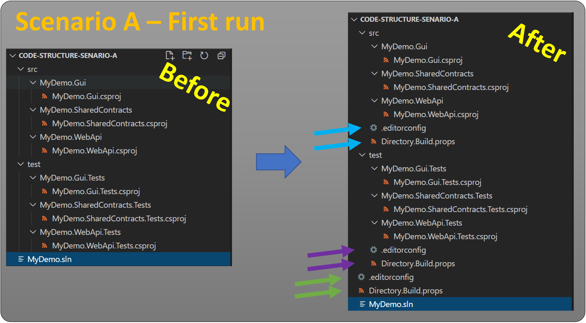
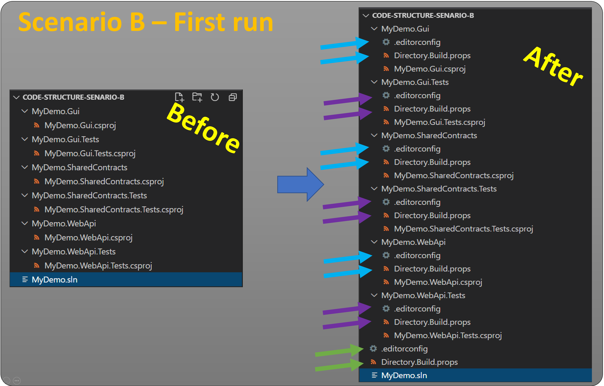
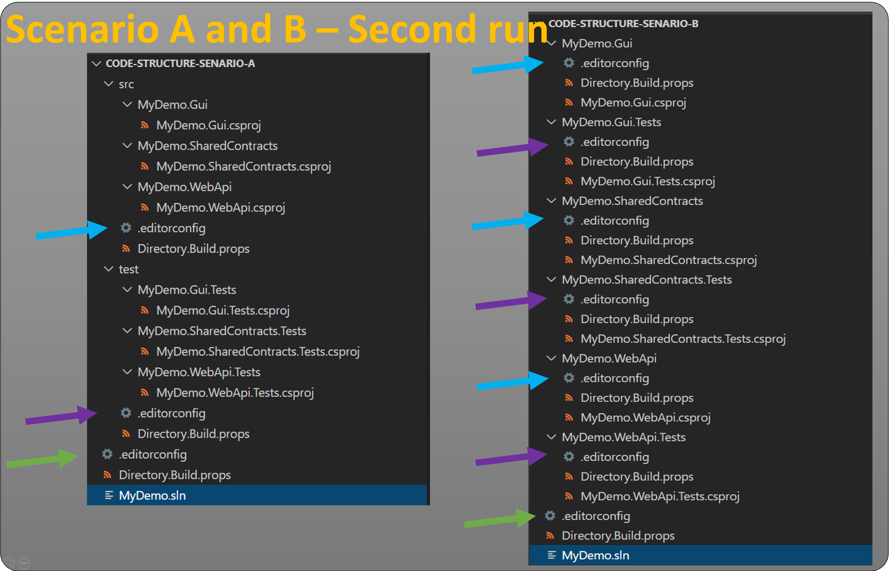

[](https://www.nuget.org/packages/atc-coding-rules-updater)

# ATC-NET Coding rules updater

This repository contains a CLI tool, which can be used to maintain `coding-rules` in a project, where [atc-coding-rules](https://github.com/atc-net/atc-coding-rules) has been utilized.

* Read about [atc-coding-rules](https://github.com/atc-net/atc-coding-rules)
* Master rule files [information](https://github.com/atc-net/atc-coding-rules/tree/main/distribution)

## Table of Contents
- [ATC-NET Coding rules updater](#atc-net-coding-rules-updater)
  - [Table of Contents](#table-of-contents)
  - [CLI Tool](#cli-tool)
    - [Requirements](#requirements)
    - [Installation](#installation)
    - [Update](#update)
    - [Usage](#usage)
      - [Option --help](#option---help)
      - [Command run](#command-run)
      - [Command sanity-check](#command-sanity-check)
      - [Command options-file](#command-options-file)
    - [Example](#example)
  - [Options file schema / example](#options-file-schema--example)
    - [atc-coding-rules-updater.json example 1](#atc-coding-rules-updaterjson-example-1)
    - [atc-coding-rules-updater.json example 2](#atc-coding-rules-updaterjson-example-2)
    - [atc-coding-rules-updater.json default](#atc-coding-rules-updaterjson-default)
  - [CLI Tool Usage from powershell](#cli-tool-usage-from-powershell)
  - [Deep dive in what `atc-coding-rules-updater` actual does and doesn't do](#deep-dive-in-what-atc-coding-rules-updater-actual-does-and-doesnt-do)
    - [A use case-scenario for coding rules structure setups - Scenario A](#a-use-case-scenario-for-coding-rules-structure-setups---scenario-a)
    - [A use case-scenario for coding rules structure setups - Scenario B](#a-use-case-scenario-for-coding-rules-structure-setups---scenario-b)
    - [For both use-case scenarios](#for-both-use-case-scenarios)
  - [Temporary suppressions](#temporary-suppressions)
    - [Build](#build)
  - [How to contribute](#how-to-contribute)

## CLI Tool

The Atc.CodingRules.Updater.CLI library is available through a cross platform command line application.

### Requirements

* [.NET 8 SDK](https://dotnet.microsoft.com/en-us/download/dotnet/8.0)

### Installation

The tool can be installed as a .NET Core global tool by the following command

```powershell
dotnet tool install --global atc-coding-rules-updater
```

or by following the instructions [here](https://www.nuget.org/packages/atc-coding-rules-updater/) to install a specific version of the tool.

A successful installation will output something like

```powershell
The tool can be invoked by the following command: atc-coding-rules-updater
Tool 'atc-coding-rules-updater' (version '2.0.xxx') was successfully installed.`
```

### Update

The tool can be updated by following command

```powershell
dotnet tool update --global atc-coding-rules-updater
```

### Usage

Since the tool is published as a .NET Tool, it can be launched from anywhere using any shell or command-line interface by calling **atc-coding-rules-updater**. The help information is displayed when providing the `--help` argument to **atc-coding-rules-updater**

#### Option <span style="color:yellow">--help</span>
```powershell
atc-coding-rules-updater --help


USAGE:
    atc-coding-rules-updater.exe [OPTIONS]

OPTIONS:
    -h, --help       Prints help information
    -v, --verbose    Use verbose for more debug/trace information
        --version    Display version

COMMANDS:
    run                   Update the project folder with ATC coding rules and configurations
    sanity-check          Sanity check the project files
    options-file          Commands for the options file 'atc-coding-rules-updater.json'
    analyzer-providers    Commands for analyzer providers
```

#### Command <span style="color:yellow">run</span>
```powershell
USAGE:
    atc-coding-rules-updater.exe run [OPTIONS]

EXAMPLES:
    atc-coding-rules-updater.exe .         (equivalent to 'run -p [CurrentFolder]')
    atc-coding-rules-updater.exe run .     (equivalent to 'run -p [CurrentFolder]')
    atc-coding-rules-updater.exe run -p .  (equivalent to 'run -p [CurrentFolder]')
    atc-coding-rules-updater.exe run -p c:\temp\MyProject
    atc-coding-rules-updater.exe run -p c:\temp\MyProject -t DotNetCore --useTemporarySuppressions  --organizationName
MyCompany  --repositoryName MyRepo -v

OPTIONS:
    -h, --help                                                   Prints help information
    -v, --verbose                                                Use verbose for more debug/trace information
    -p, --projectPath <PROJECTPATH>                              Path to the project directory (default current
                                                                 diectory)
    -o, --optionsPath [OPTIONSPATH]                              Path to an optional options json-file
    -t, --projectTarget [PROJECTTARGET]                          Sets the ProjectTarget. Valid values are: DotNetCore,
                                                                 DotNet5, DotNet6, DotNet7, DotNet8 (default)
        --useLatestMinorNugetVersion                             Indicate if nuget packages should by updated to latest
                                                                 minor version (default true)
        --useTemporarySuppressions                               Indicate if build process should use temporary
                                                                 suppressions - appends to .editorconfig - unless
                                                                 temporarySuppressionPath is set
        --temporarySuppressionPath [TEMPORARYSUPPRESSIONPATH]    Optional path to temporary suppressions file - if not
                                                                 set .editorconfig file is used
        --temporarySuppressionAsExcel                            Indicate if temporary suppressions file should be saved
                                                                 as Excel (.xlsx)
        --buildFile [BUILDFILE]                                  Solution/project file - required when multiple .sln
                                                                 files exists in root path
        --organizationName [ORGANIZATIONNAME]                    Optional: Specify the name of your organization for the
                                                                 Directory.Build.Props file
        --repositoryName [REPOSITORYNAME]                        Optional: Specify the name of your repository for the
                                                                 Directory.Build.Props file
```

#### Command <span style="color:yellow">sanity-check</span>
```powershell
USAGE:
    atc-coding-rules-updater.exe sanity-check [OPTIONS]

EXAMPLES:
    atc-coding-rules-updater.exe sanity-check .         (equivalent to 'sanity-check -p [CurrentFolder]')
    atc-coding-rules-updater.exe sanity-check -p c:\temp\MyProject
    atc-coding-rules-updater.exe sanity-check -p c:\temp\MyProject -t DotNetCore -v

OPTIONS:
    -h, --help                             Prints help information
    -v, --verbose                          Use verbose for more debug/trace information
    -p, --projectPath <PROJECTPATH>        Path to the project directory (default current diectory)
    -o, --optionsPath [OPTIONSPATH]        Path to an optional options json-file
    -t, --projectTarget [PROJECTTARGET]    Sets the ProjectTarget. Valid values are: DotNetCore, DotNet5, DotNet6, DotNet7, DotNet8 (default)
```

#### Command <span style="color:yellow">options-file</span>
```powershell
USAGE:
    atc-coding-rules-updater.exe options-file [OPTIONS] <COMMAND>

EXAMPLES:
    atc-coding-rules-updater.exe options-file create .       (equivalent to 'options-file create -p [CurrentFolder]')
    atc-coding-rules-updater.exe options-file create -p .    (equivalent to 'options-file create -p [CurrentFolder]')
    atc-coding-rules-updater.exe options-file create -p c:\temp\MyProject
    atc-coding-rules-updater.exe options-file create -p c:\temp\MyProject -t DotNet5
    atc-coding-rules-updater.exe options-file validate .     (equivalent to 'options-file validate -p [CurrentFolder]')
    atc-coding-rules-updater.exe options-file validate -p c:\temp\MyProject

OPTIONS:
    -h, --help    Prints help information

COMMANDS:
    create      Create default options file 'atc-coding-rules-updater.json' if it doesn´t exist
    validate    Validate the options file 'atc-coding-rules-updater.json'
```

### Example

Having a project folder in c:\code\MyProject where the .sln file for C# projects exists in the root, run the following command

```powershell
atc-coding-rules-updater run -p c:\code\MyProject -v
```

Running the command above produces the following output

```powershell
  ____            _                                      _           _
 |  _ \   _   _  | |   ___   ___     _   _   _ __     __| |   __ _  | |_    ___   _ __
 | |_) | | | | | | |  / _ \ / __|   | | | | | `_ \   / _` |  / _` | | __|  / _ \ | `__|
 |  _ <  | |_| | | | |  __/ \__ \   | |_| | | |_) | | (_| | | (_| | | |_  |  __/ | |
 |_| \_\  \__,_| |_|  \___| |___/    \__,_| | .__/   \__,_|  \__,_|  \__|  \___| |_|
                                            |_|
🐭 Working on EditorConfig files
🟢   root: .editorconfig files merged
🟢   sample: .editorconfig created
🟢   src: .editorconfig created
🟢   test: .editorconfig created
🔨 Working on Directory.Build.props files
🟢   root: Directory.Build.props created
🟢   sample: Directory.Build.props created
🟢   src: Directory.Build.props created
🟢   test: Directory.Build.props created
✅ Done
```

## Options file schema / example

The tool has an optional options parameter, which can be used to control the paths for persisting the .editorconfigs and props files. This can be applied as follows `--optionsPath 'C:\Temp\atc-coding-rules-updater.json'`

### atc-coding-rules-updater.json example 1

```json
{
    "mappings": {
        "sample": {
            "paths": [
                "C:\\Temp\\MyProject\\sample1",
                "C:\\Temp\\MyProject\\sample2"
            ]
        },
        "src": {
            "paths": [
                "C:\\Temp\\MyProject\\src"
            ]
        },
        "test": {
            "paths": [
                "C:\\Temp\\MyProject\\test"
            ]
        }
    }
}
```

### atc-coding-rules-updater.json example 2

```json
{
    "mappings": {
        "src": { "paths": [ "source" ] },
        "test": { "paths": [ "tests" ] }
    }
}
```

### atc-coding-rules-updater.json default

```json
{
  "projectTarget": "DotNet8",
  "useLatestMinorNugetVersion": true,
  "useTemporarySuppressions": false,
  "temporarySuppressionAsExcel": false,
  "analyzerProviderCollectingMode": "LocalCache",
  "mappings": {
    "src": {
      "paths": [
        "src"
      ]
    },
    "test": {
      "paths": [
        "test"
      ]
    }
  }
}
```

**Note:** If there is a `atc-coding-rules-updater.json` file present in the root folder (given by options `--projectPath` /  `-p`), then it will automatically be found and used. Other given arguments will then override.

## CLI Tool Usage from powershell

To ensure that the latest version of the CLI tool `atc-coding-rules-updater` is being used, the following methodology can be used:

1) Download the 2 files from `sample` into a project root folder.
2) Modify the `atc-coding-rules-updater.json` to the projects specific needs.
3) Run `atc-coding-rules-updater.ps1` from powershell

## Deep dive in what `atc-coding-rules-updater` actual does and doesn't do

The `atc-coding-rules-updater` downloads files from the [atc-coding-rules repository's distribution folder](https://github.com/atc-net/atc-coding-rules/tree/main/distribution).

From here it works with 2 concepts:

* Scaffolding files (`.editorconfig` and `Directory.Build.props`) - if a file does not exist - it creates a copy.
* Updating files (`.editorconfig`) - if a file exist - updates the files first content part and does not touch the second content part.
  * First content part is related to rules above the line `# Custom - Code Analyzers Rules` - and will be updated - herafter known as ATC-part.
  * Second content part is related to rules below the line `# Custom - Code Analyzers Rules` - and will not be touched - herafter known as Customer-part.

### A use case-scenario for coding rules structure setups - Scenario A

In scenario A we have root where `src` and `test` destination is defined as:

```json
{
    "mappings": {
        "src": { "paths": [ "src" ] },
        "test": { "paths": [ "test" ] }
    }
}
```

When the `atc-coding-rules-update` is exceuted first time, the following happens (see legend for explanation):

*  arrows indicate files created in `root` folder.
*  arrows indicate files created in `src` folder.
*  arrows indicate files created in `test` folder.



### A use case-scenario for coding rules structure setups - Scenario B

In this scenario we have root where `src` and `test` destination is defined as:

```json
{
    "mappings": {
        "src": { "paths": [
            "MyDemo.Gui",
            "MyDemo.SharedContracts",
            "MyDemo.WebApi"
            ] },
        "test": { "paths": [
            "MyDemo.Gui.Tests",
            "MyDemo.SharedContracts.Tests",
            "MyDemo.WebApi.Tests"
            ] }
    }
}
```

When the `atc-coding-rules-update` is executed first time, the following happens (see legend for explanation):

*  arrows indicate files created in `root` folder.
*  arrows indicate files created in `src` folder.
*  arrows indicate files created in `test` folder.



### For both use-case scenarios

For both scenario A and scenario B, when the `atc-coding-rules-update` is executed a second time it will only update `.editorconfig` file. And as previously stated, it will only update the ATC-part of these files.



## Temporary suppressions

When starting with ATC rules on an existing project, the general recommendation is to initially suppress all failing rules in your Custom section in order to get back to ✅ state for the project, and then later clean up the code and remove the suppressions one by one in nice clean commits.

The challenge is that this initial suppression list takes a long time to hand-write. In order to circumvent this tedious process, some extra flags have been added to the CLI to allow for auto-generation of these suppression lines. When utilizing these new options, the updater process will run a dotnet build on your project and extract any errors and create suppressions for these along with a count of how many occurences are present. The CLI will also add additional information, e.g: Category, Title, Link to the rule being broken.

The three CLI options for generating temporary suppressions are as follows.

```json
--useTemporarySuppressions      Use temporary suppressions from build - appends to .editorconfig - unless temporarySuppressionPath is set
--temporarySuppressionPath      Optional path to temporary suppressions file - if not set .editorconfig file is used
--temporarySuppressionAsExcel   Optional - save temporary suppressions file as Excel (.xlsx)
```

Below an example of the auto-generated supressions is shown:

```json
##########################################
# ATC temporary suppressions
# generated @ 21. juni 2021 02:33:34
# Please fix all generated temporary suppressions
# either by code changes or move the
# suppressions one by one to the relevant
# 'Custom - Code Analyzers Rules' section.
##########################################

# Microsoft.CodeAnalysis.NetAnalyzers
dotnet_diagnostic.CA1303.severity = none            # 1 occurrence - Do not pass literals as localized parameters - https://docs.microsoft.com/en-us/dotnet/fundamentals/code-analysis/quality-rules/ca1303
dotnet_diagnostic.CA1707.severity = none            # 1 occurrence - Identifiers should not contain underscores - https://docs.microsoft.com/en-us/dotnet/fundamentals/code-analysis/quality-rules/ca1707
dotnet_diagnostic.CA1801.severity = none            # 1 occurrence - Review unused parameters - https://docs.microsoft.com/en-us/dotnet/fundamentals/code-analysis/quality-rules/ca1801

# SonarAnalyzer.CSharp
dotnet_diagnostic.S1118.severity = none             # 1 occurrence - Category: 'Code Smell' - Utility classes should not have public constructors - https://rules.sonarsource.com/csharp/RSPEC-1118

# StyleCop.Analyzers
dotnet_diagnostic.SA1400.severity = none            # 2 occurrences - Category: 'Maintainability' - Access modifier must be declared - https://github.com/DotNetAnalyzers/StyleCopAnalyzers/blob/master/documentation/SA1400.md
```

### Build

When using the `--useTemporarySuppressions` option, a `dotnet.exe build` will be executed (up to 10 times depending on the complexity of the solution).
Hence a requirement is that dotnet.exe can be called from the root path.
If there are multiple solutions (.sln) files in the root folder, the `--buildFile` option will then be required as a parameter when calling the CLI tool.

```json
--buildFile                 Optional path to solution/project file - required when multiple .sln files exists in root path
```

## How to contribute

[Contribution Guidelines](https://atc-net.github.io/introduction/about-atc#how-to-contribute)

[Coding Guidelines](https://atc-net.github.io/introduction/about-atc#coding-guidelines)
