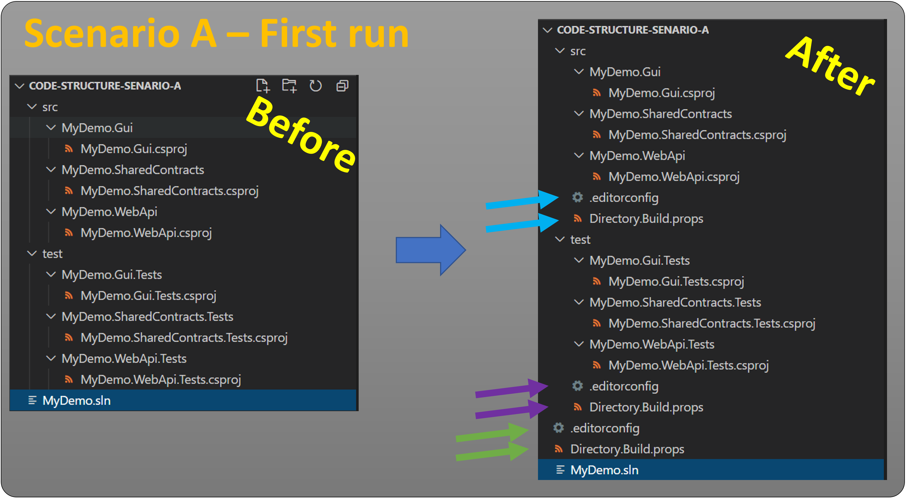
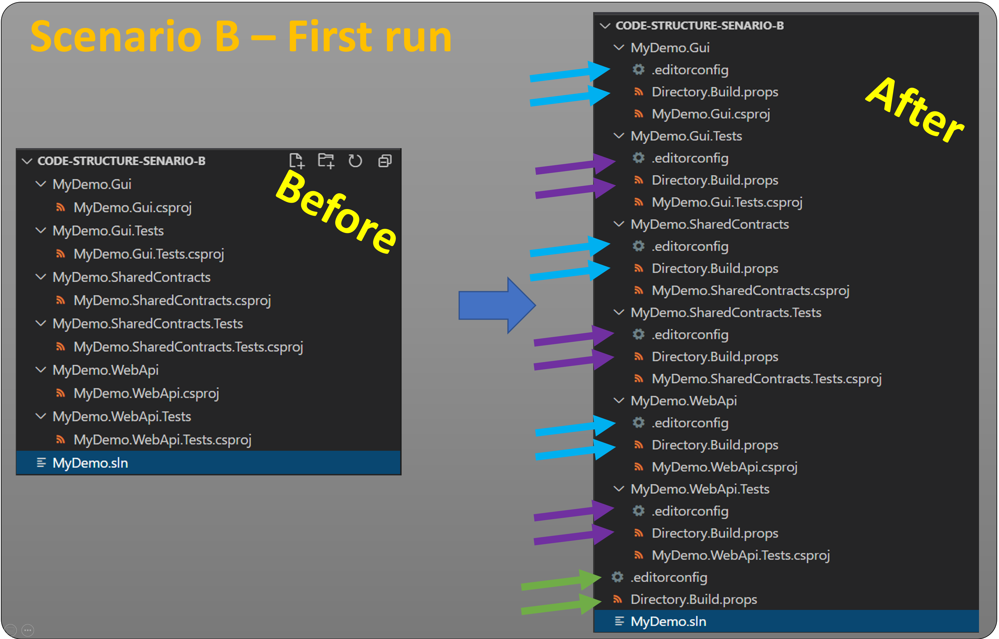
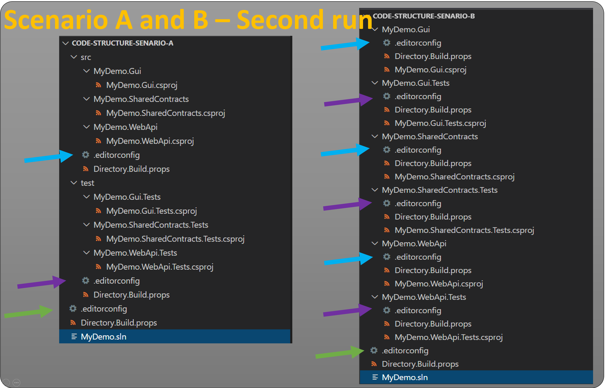

[](https://www.nuget.org/packages/atc-coding-rules-updater)

# ATC-NET Coding rules updater

This repository contains a CLI tool, which can be used to maintain `coding-rules` in a project, where [atc-coding-rules](https://github.com/atc-net/atc-coding-rules) has been utilized.

* Read about [atc-coding-rules](https://github.com/atc-net/atc-coding-rules)
* Master rule files [information](https://github.com/atc-net/atc-coding-rules/tree/main/distribution)

## Table of Contents
- [ATC-NET Coding rules updater](#atc-net-coding-rules-updater)
  - [Table of Contents](#table-of-contents)
  - [CLI Tool](#cli-tool)
    - [Requirements](#requirements)
    - [Installation](#installation)
    - [Update](#update)
    - [Usage](#usage)
      - [Option --help](#option---help)
      - [Command run](#command-run)
      - [Command sanity-check](#command-sanity-check)
      - [Command analyzer-providers](#command-analyzer-providers)
      - [Command options-file](#command-options-file)
    - [Example](#example)
  - [Options file schema / example](#options-file-schema--example)
    - [atc-coding-rules-updater.json example 1](#atc-coding-rules-updaterjson-example-1)
    - [atc-coding-rules-updater.json example 2](#atc-coding-rules-updaterjson-example-2)
    - [atc-coding-rules-updater.json example 3](#atc-coding-rules-updaterjson-example-3)
    - [atc-coding-rules-updater.json default](#atc-coding-rules-updaterjson-default)
  - [CLI Tool Usage from powershell](#cli-tool-usage-from-powershell)
  - [Deep dive in what `atc-coding-rules-updater` actual does and doesn't do](#deep-dive-in-what-atc-coding-rules-updater-actual-does-and-doesnt-do)
    - [A use case-scenario for coding rules structure setups - Scenario A](#a-use-case-scenario-for-coding-rules-structure-setups---scenario-a)
    - [A use case-scenario for coding rules structure setups - Scenario B](#a-use-case-scenario-for-coding-rules-structure-setups---scenario-b)
    - [For both use-case scenarios](#for-both-use-case-scenarios)
  - [Temporary suppressions](#temporary-suppressions)
    - [Build](#build)
  - [How to contribute](#how-to-contribute)

## CLI Tool

The Atc.CodingRules.Updater.CLI library is available through a cross platform command line application.

### Requirements

* [.NET 10 SDK](https://dotnet.microsoft.com/en-us/download/dotnet/10.0)

The CLI itself targets .NET 10. The `--projectTarget` option lets you point at older runtimes — supported values are `DotNetCore`, `DotNet5`, `DotNet6`, `DotNet7`, `DotNet8`, `DotNet9`, `DotNet10` (default), `DotNet11`.

### Installation

The tool can be installed as a .NET Core global tool by the following command

```powershell
dotnet tool install --global atc-coding-rules-updater --ignore-failed-sources
```

or by following the instructions [here](https://www.nuget.org/packages/atc-coding-rules-updater/) to install a specific version of the tool.

A successful installation will output something like

```powershell
The tool can be invoked by the following command: atc-coding-rules-updater
Tool 'atc-coding-rules-updater' (version '2.0.xxx') was successfully installed.`
```

### Update

The tool can be updated by following command

```powershell
dotnet tool update --global atc-coding-rules-updater --ignore-failed-sources
```

### Usage

Since the tool is published as a .NET Tool, it can be launched from anywhere using any shell or command-line interface by calling **atc-coding-rules-updater**. The help information is displayed when providing the `--help` argument to **atc-coding-rules-updater**

#### Option <span style="color:yellow">--help</span>
```powershell
atc-coding-rules-updater --help


USAGE:
    atc-coding-rules-updater.exe [OPTIONS]

OPTIONS:
    -h, --help       Prints help information
        --verbose    Use verbose for more debug/trace information
    -v, --version    Display version

COMMANDS:
    run                   Update the project folder with ATC coding rules and configurations
    sanity-check          Sanity check the project files
    options-file          Commands for the options file 'atc-coding-rules-updater.json'
    analyzer-providers    Commands for analyzer providers
```

#### Command <span style="color:yellow">run</span>
```powershell
USAGE:
    atc-coding-rules-updater.exe run [OPTIONS]

EXAMPLES:
    atc-coding-rules-updater.exe .         (equivalent to 'run -p [CurrentFolder]')
    atc-coding-rules-updater.exe run .     (equivalent to 'run -p [CurrentFolder]')
    atc-coding-rules-updater.exe run -p .  (equivalent to 'run -p [CurrentFolder]')
    atc-coding-rules-updater.exe run -p c:\temp\MyProject
    atc-coding-rules-updater.exe run -p c:\temp\MyProject -t DotNetCore --useTemporarySuppressions  --organizationName
MyCompany  --repositoryName MyRepo --verbose

OPTIONS:
    -h, --help                                                   Prints help information
        --verbose                                                Use verbose for more debug/trace information
    -p, --projectPath <PROJECTPATH>                              Path to the project directory (default current
                                                                 diectory)
    -o, --optionsPath [OPTIONSPATH]                              Path to an optional options json-file
    -t, --projectTarget [PROJECTTARGET]                          Sets the ProjectTarget. Valid values are: DotNetCore,
                                                                 DotNet5, DotNet6, DotNet7, DotNet8, DotNet9,
                                                                 DotNet10 (default), DotNet11
        --useLatestMinorNugetVersion                             Bump PackageReferences in Directory.Build.props to the
                                                                 latest version within the same major version.
                                                                 (default true)
    -s, --useTemporarySuppressions                               Build the project, collect analyzer errors, and write
                                                                 temporary suppressions. Appended to .editorconfig
                                                                 unless --temporarySuppressionPath is set.
                                                                 (default false)
        --temporarySuppressionPath [TEMPORARYSUPPRESSIONPATH]    Optional output directory for the
                                                                 temporary-suppressions file. When set, the
                                                                 .editorconfig is not modified
        --temporarySuppressionAsExcel                            Write the temporary-suppressions file as Excel (.xlsx)
                                                                 instead of plain text. (default false)
        --buildFile [BUILDFILE]                                  Solution (.sln/.slnx) or project (.csproj) file to
                                                                 build. Required when multiple solution files exist in
                                                                 --projectPath
        --organizationName [ORGANIZATIONNAME]                    Organization name to substitute into the
                                                                 <OrganizationName> placeholder in Directory.Build.props
        --repositoryName [REPOSITORYNAME]                        Repository name to substitute into the
                                                                 <RepositoryName> placeholder in Directory.Build.props
        --dry-run                                                Preview mode: log what would be created or updated
                                                                 without writing any files. Skips the
                                                                 temporary-suppression build loop. (default false)
        --forceNugetRefresh                                      Ask the ATC API to re-read package versions from
                                                                 nuget.org instead of serving its 12-hour cache. Use
                                                                 when a just-published version is not being picked up.
                                                                 (default false)
        --failOnChanges                                          Exit with a non-zero code when any file was created or
                                                                 updated. Combine with --dry-run to gate CI on "coding
                                                                 rules are current" without writing anything.
                                                                 (default false)
        --json                                                   Emit a machine-readable JSON summary on stdout
                                                                 (per-file outcomes, package bumps, props drift)
                                                                 instead of log output. Useful for CI.
```

##### Gating CI on "coding rules are current"

`--failOnChanges` combined with `--dry-run` writes nothing and returns `1` as soon as any file
would be created or updated, so a pull request can be blocked without the PR-creating workflow:

```powershell
atc-coding-rules-updater run -p . --dry-run --failOnChanges
```

Reported-but-not-applied drift does **not** trip it. Drift is never applied by the tool, so a
re-run would not resolve it and failing on it would leave the build permanently red.

##### Machine-readable output

`--json` writes a single JSON document to stdout and nothing else, so it can be piped straight
into `jq`:

```json
{
  "DryRun": true,
  "Files": [
    { "Area": "root", "File": ".editorconfig", "Path": "...", "Outcome": "Unchanged" },
    { "Area": "root", "File": "Directory.Build.props", "Path": "...", "Outcome": "Updated" }
  ],
  "PackageBumps": [
    { "PackageId": "Meziantou.Analyzer", "FromVersion": "3.0.135", "ToVersion": "3.0.136" }
  ],
  "Drift": [
    {
      "Area": "src",
      "PackagesOnlyInDistribution": [],
      "PackagesOnlyInLocalFile": [ "Nerdbank.GitVersioning" ],
      "PropertiesOnlyInDistribution": []
    }
  ],
  "HasChanges": true
}
```

`Outcome` is one of `Unchanged`, `Created`, `Updated` or `Skipped`. `Skipped` means the
distribution had nothing to offer for that path; `Unchanged` means the local file was already
correct. Under `--dry-run` the same values describe what *would* have happened.

Two limitations of this mode:

- **No diagnostics.** Log output is suppressed so that stdout contains only the JSON document, so
  `--verbose` has no effect when `--json` is set. Drop `--json` to debug a run. Per-provider and
  per-file problems still surface — failures appear as an `Error` property on the document.
- **No prompting.** `--organizationName` and `--repositoryName` must be passed explicitly when
  those placeholders are still present, since prompting would hang waiting on stdin.

**Note on `--useLatestMinorNugetVersion`:** despite the name, the bump is bounded by the **major**
version, not the minor — a package on `3.0.54` will be moved to the newest `3.x`, but never to `4.0.0`.

**Exit codes:** `run` and `sanity-check` return `0` on success and `1` on failure. `sanity-check`
returns `1` whenever any error-severity diagnostic is found, in both the default and `--json`
output modes, so it can be used directly as a CI gate.

#### Command <span style="color:yellow">sanity-check</span>
```powershell
USAGE:
    atc-coding-rules-updater.exe sanity-check [OPTIONS]

EXAMPLES:
    atc-coding-rules-updater.exe sanity-check .         (equivalent to 'sanity-check -p [CurrentFolder]')
    atc-coding-rules-updater.exe sanity-check -p c:\temp\MyProject
    atc-coding-rules-updater.exe sanity-check -p c:\temp\MyProject -t DotNetCore --verbose

OPTIONS:
    -h, --help                             Prints help information
        --verbose                          Use verbose for more debug/trace information
    -p, --projectPath <PROJECTPATH>        Path to the project directory (default current diectory)
    -o, --optionsPath [OPTIONSPATH]        Path to an optional options json-file
    -t, --projectTarget [PROJECTTARGET]    Sets the ProjectTarget. Valid values are: DotNetCore, DotNet5, DotNet6, DotNet7, DotNet8, DotNet9, DotNet10 (default), DotNet11
        --json                             Emit a machine-readable JSON summary on stdout (Severity / Code / Message / FilePath per diagnostic). Useful for CI
```

#### Command <span style="color:yellow">analyzer-providers</span>

Each analyzer provider scrapes its rule catalog from the upstream documentation site. The results
are cached under `%TEMP%/AtcAnalyzerProviderBaseRules`, and are what the temporary-suppression
feature uses to annotate suppressions with a category, title and help link.

```powershell
USAGE:
    atc-coding-rules-updater.exe analyzer-providers [OPTIONS] <COMMAND>

EXAMPLES:
    atc-coding-rules-updater.exe analyzer-providers collect .
    atc-coding-rules-updater.exe analyzer-providers collect -p c:\temp\MyProject
    atc-coding-rules-updater.exe analyzer-providers collect -p c:\temp\MyProject --fetchMode ReCollect --verbose
    atc-coding-rules-updater.exe analyzer-providers cleanup-cache

OPTIONS:
    -h, --help    Prints help information

COMMANDS:
    collect          Collect base rules metadata from all Analyzer providers
    cleanup-cache    Cleanup cache from Analyzer providers
```

Options for `analyzer-providers collect`:

```powershell
    -p, --projectPath <PROJECTPATH>              Path to the project root directory
    -o, --optionsPath [OPTIONSPATH]              Path to an atc-coding-rules-updater.json options file
        --fetchMode [FETCHMODE]                  Where to read the rule metadata from. Valid values are:
                                                 LocalCache (default), GitHub, ReCollect
        --includeProviders [INCLUDEPROVIDERS]    Comma-separated provider names to include
                                                 (e.g. "AsyncFixer,Meziantou.Analyzer"). When set, only these run
        --excludeProviders [EXCLUDEPROVIDERS]    Comma-separated provider names to exclude
                                                 (e.g. "SonarAnalyzer.CSharp"). Applied after --includeProviders
        --json                                   Emit a machine-readable JSON summary on stdout
                                                 (Name / Rules.Count / ExceptionMessage per provider). Useful for CI
```

| `--fetchMode` | Behaviour                                                                       |
|---------------|---------------------------------------------------------------------------------|
| `LocalCache`  | Use the cached snapshot in the temp folder if present; otherwise fall back to GitHub. |
| `GitHub`      | Read the pre-collected JSON from the `atc-coding-rules-updater` repository.       |
| `ReCollect`   | Re-scrape every provider's documentation site, ignoring both caches.              |

#### Command <span style="color:yellow">options-file</span>
```powershell
USAGE:
    atc-coding-rules-updater.exe options-file [OPTIONS] <COMMAND>

EXAMPLES:
    atc-coding-rules-updater.exe options-file create .       (equivalent to 'options-file create -p [CurrentFolder]')
    atc-coding-rules-updater.exe options-file create -p .    (equivalent to 'options-file create -p [CurrentFolder]')
    atc-coding-rules-updater.exe options-file create -p c:\temp\MyProject
    atc-coding-rules-updater.exe options-file create -p c:\temp\MyProject -t DotNet5
    atc-coding-rules-updater.exe options-file validate .     (equivalent to 'options-file validate -p [CurrentFolder]')
    atc-coding-rules-updater.exe options-file validate -p c:\temp\MyProject

OPTIONS:
    -h, --help    Prints help information

COMMANDS:
    create      Create default options file 'atc-coding-rules-updater.json' if it doesn´t exist
    validate    Validate the options file 'atc-coding-rules-updater.json'
```

### Example

Having a project folder in c:\code\MyProject where the .sln file for C# projects exists in the root, run the following command

```powershell
atc-coding-rules-updater run -p c:\code\MyProject --verbose
```

Running the command above produces the following output

```powershell
  ____            _                                      _           _
 |  _ \   _   _  | |   ___   ___     _   _   _ __     __| |   __ _  | |_    ___   _ __
 | |_) | | | | | | |  / _ \ / __|   | | | | | `_ \   / _` |  / _` | | __|  / _ \ | `__|
 |  _ <  | |_| | | | |  __/ \__ \   | |_| | | |_) | | (_| | | (_| | | |_  |  __/ | |
 |_| \_\  \__,_| |_|  \___| |___/    \__,_| | .__/   \__,_|  \__,_|  \__|  \___| |_|
                                            |_|
🐭 Working on EditorConfig files
🟢   root: .editorconfig files merged
🟢   sample: .editorconfig created
🟢   src: .editorconfig created
🟢   test: .editorconfig created
🔨 Working on Directory.Build.props files
🟢   root: Directory.Build.props created
🟢   sample: Directory.Build.props created
🟢   src: Directory.Build.props created
🟢   test: Directory.Build.props created
✅ Done
```

## Options file schema / example

The tool has an optional options parameter, which can be used to control the paths for persisting the .editorconfigs and props files. This can be applied as follows `--optionsPath 'C:\Temp\atc-coding-rules-updater.json'`

By default the atc-coding-rules-updater will detect projects in the solution and try to fetch the matching project specific rules and supply an .editorconfig in those projects. This mapping can however be over-ruled as seen in [atc-coding-rules-updater.json example 3](#atc-coding-rules-updaterjson-example-3)

### atc-coding-rules-updater.json example 1

```json
{
    "mappings": {
        "sample": {
            "paths": [
                "C:\\Temp\\MyProject\\sample1",
                "C:\\Temp\\MyProject\\sample2"
            ]
        },
        "src": {
            "paths": [
                "C:\\Temp\\MyProject\\src"
            ]
        },
        "test": {
            "paths": [
                "C:\\Temp\\MyProject\\test"
            ]
        }
    }
}
```

### atc-coding-rules-updater.json example 2

```json
{
    "mappings": {
        "src": { "paths": [ "source" ] },
        "test": { "paths": [ "tests" ] }
    }
}
```

### atc-coding-rules-updater.json example 3

In this example a project framework mapping has been added. The entry is mapped using the CsProj fileName and the specific ProjectFrameworkType. Currently the supported values for project framework type are [defined here](/src/Atc.CodingRules.Updater/ProjectFrameworkType.cs)

By specifying this mapping it will over-rule the automatic detection of the project framework type.

```json
{
    "projectTarget": "DotNet10",
    "mappings": {
        "sample": { "paths": [ "sample" ] },
        "src": { "paths": [ "src" ] },
        "test": { "paths": [ "test" ] }
    },
    "projectFrameworkMappings": [
    {
      "name": "HelloWorldWpf",
      "type": "Wpf"
    }
  ]
}
```

### atc-coding-rules-updater.json default

```json
{
  "projectTarget": "DotNet10",
  "useLatestMinorNugetVersion": true,
  "useTemporarySuppressions": false,
  "temporarySuppressionAsExcel": false,
  "analyzerProviderCollectingMode": "LocalCache",
  "mappings": {
    "src": {
      "paths": [
        "src"
      ]
    },
    "test": {
      "paths": [
        "test"
      ]
    }
  },
  "projectFrameworkMappings": []
}
```

**Note:** If there is a `atc-coding-rules-updater.json` file present in the root folder (given by options `--projectPath` /  `-p`), then it will automatically be found and used. Other given arguments will then override.

## CLI Tool Usage from PowerShell or Bash

To ensure that the latest version of the CLI tool `atc-coding-rules-updater` is being used, the following methodology can be used:

1) Download the 2 files from `sample` into a project root folder.
2) Modify the `atc-coding-rules-updater.json` to the projects specific needs.
3) Run `atc-coding-rules-updater.ps1` from PowerShell, or `atc-coding-rules-updater.sh` from Bash (copy it from the repository root alongside the `atc-coding-rules-updater.json`).

## Deep dive in what `atc-coding-rules-updater` actual does and doesn't do

The `atc-coding-rules-updater` downloads files from the [atc-coding-rules repository's distribution folder](https://github.com/atc-net/atc-coding-rules/tree/main/distribution).

From here it works with 2 concepts:

* Scaffolding files (`.editorconfig` and `Directory.Build.props`) - if a file does not exist - it creates a copy.
* Updating files (`.editorconfig`) - if a file exist - updates the files first content part and does not touch the second content part.
  * First content part is related to rules above the line `# Custom - Code Analyzers Rules` - and will be updated - herafter known as ATC-part.
  * Second content part is related to rules below the line `# Custom - Code Analyzers Rules` - and will not be touched - herafter known as Customer-part.

### A use case-scenario for coding rules structure setups - Scenario A

In scenario A we have root where `src` and `test` destination is defined as:

```json
{
    "mappings": {
        "src": { "paths": [ "src" ] },
        "test": { "paths": [ "test" ] }
    }
}
```

When the `atc-coding-rules-update` is exceuted first time, the following happens (see legend for explanation):

*  arrows indicate files created in `root` folder.
*  arrows indicate files created in `src` folder.
*  arrows indicate files created in `test` folder.



### A use case-scenario for coding rules structure setups - Scenario B

In this scenario we have root where `src` and `test` destination is defined as:

```json
{
    "mappings": {
        "src": { "paths": [
            "MyDemo.Gui",
            "MyDemo.SharedContracts",
            "MyDemo.WebApi"
            ] },
        "test": { "paths": [
            "MyDemo.Gui.Tests",
            "MyDemo.SharedContracts.Tests",
            "MyDemo.WebApi.Tests"
            ] }
    }
}
```

When the `atc-coding-rules-update` is executed first time, the following happens (see legend for explanation):

*  arrows indicate files created in `root` folder.
*  arrows indicate files created in `src` folder.
*  arrows indicate files created in `test` folder.



### For both use-case scenarios

For both scenario A and scenario B, when the `atc-coding-rules-update` is executed a second time it will only update `.editorconfig` file. And as previously stated, it will only update the ATC-part of these files.



## Temporary suppressions

When starting with ATC rules on an existing project, the general recommendation is to initially suppress all failing rules in your Custom section in order to get back to ✅ state for the project, and then later clean up the code and remove the suppressions one by one in nice clean commits.

The challenge is that this initial suppression list takes a long time to hand-write. In order to circumvent this tedious process, some extra flags have been added to the CLI to allow for auto-generation of these suppression lines. When utilizing these new options, the updater process will run a dotnet build on your project and extract any errors and create suppressions for these along with a count of how many occurences are present. The CLI will also add additional information, e.g: Category, Title, Link to the rule being broken.

The three CLI options for generating temporary suppressions are as follows.

```json
--useTemporarySuppressions      Use temporary suppressions from build - appends to .editorconfig - unless temporarySuppressionPath is set
--temporarySuppressionPath      Optional path to temporary suppressions file - if not set .editorconfig file is used
--temporarySuppressionAsExcel   Optional - save temporary suppressions file as Excel (.xlsx)
```

Below an example of the auto-generated supressions is shown:

```json
##########################################
# ATC temporary suppressions
# generated @ 21. juni 2021 02:33:34
# Please fix all generated temporary suppressions
# either by code changes or move the
# suppressions one by one to the relevant
# 'Custom - Code Analyzers Rules' section.
##########################################

# Microsoft.CodeAnalysis.NetAnalyzers
dotnet_diagnostic.CA1303.severity = none            # 1 occurrence - Do not pass literals as localized parameters - https://docs.microsoft.com/en-us/dotnet/fundamentals/code-analysis/quality-rules/ca1303
dotnet_diagnostic.CA1707.severity = none            # 1 occurrence - Identifiers should not contain underscores - https://docs.microsoft.com/en-us/dotnet/fundamentals/code-analysis/quality-rules/ca1707
dotnet_diagnostic.CA1801.severity = none            # 1 occurrence - Review unused parameters - https://docs.microsoft.com/en-us/dotnet/fundamentals/code-analysis/quality-rules/ca1801

# SonarAnalyzer.CSharp
dotnet_diagnostic.S1118.severity = none             # 1 occurrence - Category: 'Code Smell' - Utility classes should not have public constructors - https://rules.sonarsource.com/csharp/RSPEC-1118

# StyleCop.Analyzers
dotnet_diagnostic.SA1400.severity = none            # 2 occurrences - Category: 'Maintainability' - Access modifier must be declared - https://github.com/DotNetAnalyzers/StyleCopAnalyzers/blob/master/documentation/SA1400.md
```

### Build

When using the `--useTemporarySuppressions` option, a `dotnet.exe build` will be executed (up to 10 times depending on the complexity of the solution).
Hence a requirement is that dotnet.exe can be called from the root path.
If there are multiple solution files in the root folder, the `--buildFile` option will then be required as a parameter when calling the CLI tool.

```json
--buildFile                 Optional path to solution/project file - required when multiple solution files exist in the root path
```

Recognised solution and project files are `.sln`, `.slnx` and `.csproj`. If the root path contains
none of these, the build loop is skipped with a message rather than failing.

## How to contribute

[Contribution Guidelines](https://atc-net.github.io/introduction/about-atc#how-to-contribute)

[Coding Guidelines](https://atc-net.github.io/introduction/about-atc#coding-guidelines)
